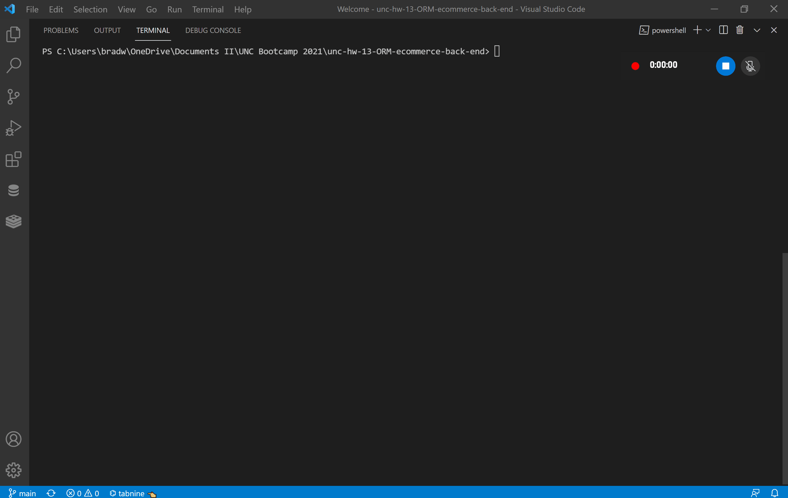

# ORM E-Commerce Backend

## An example of making requests on the backend of an e-commerce website

## Table of Contents

- [Motivation and Technologies](#motivation)
- [Functionality](#functionality)
- [Challenges](#challenges)

## Motivation

The goal of this project is to showcase using ORM's functionality and use a RESTful API

#### Technologies

- javascript
- node.js
- mysql package
- dotenv package
- express package
- sequelize package
- insomnia

## Functionality

#### Walkthrough of using the terminal to create a database, seed the database and start the server

#### Walkthrough of using Insomnia to make requests to the server

## Challenges

The major challenge faced when creating this application was figuring out how to get the requests to run without returning 400 errors
